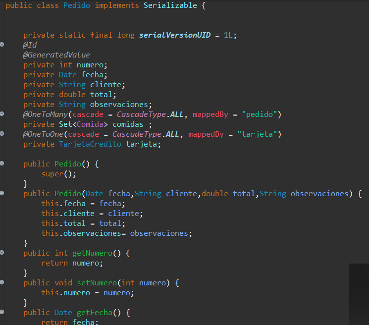

Esta es la estructura general de todo el proyecto que hemos realizado

Esta es la persistencia de jpa se ingresan las entidades a la base de datos

La estructura de la base de datos queda de la siguiente manera :

La primera entidad a generar fue el pedido que queda de la siguiente manera ya que tiene muchas comidas y se debe pagar con una trajeta de credito

La segunda entidad a crear fue la de comidas ya que estas pueden estar muchas comidas en un pedido

Y por ultimo nos dirigimos a crear la ultima entidad que es la Tarjeta de Credito

En esta interfaz jsp podemos ingresar a la base de datos varios tipos de comida con su respectivo precio

En esta interfaz podemos realizar un pedido pero en este caso le hemos puesto solo una comida

En la base de datos podemos observar que se ha creado el pedido y se le asignado a cada comida un numero de pedido al igual que a la tarjeta de credito

En el caso de las tarjetas de credito hemos realizado un controlador para que este no cree las tarjetas

LO QUE FALTARIA SERIA LISTAR TODAS LAS COMIDAS QUE POSEE UN PEDIDO CON SU TARJETA DE CREDITO.
